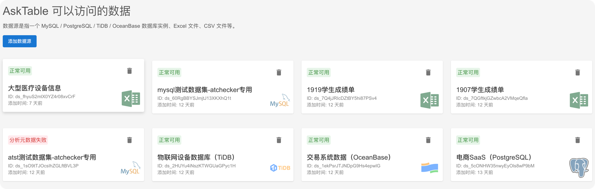

# 支持的数据库类型

AskTable 支持多种类型的数据库和数据源，方便您灵活地集成不同的数据源进行查询和分析。以下是目前支持的数据源类型：

## 支持的数据源类型

- **MySQL**: 支持版本 8.0 及以上
- **PostgreSQL**: 支持版本 13 及以上
- **TiDB**: 分布式 SQL 数据库，兼容 MySQL 协议
- **OceanBase**: 分布式关系数据库，兼容 MySQL 协议
- **Excel 文件**: 支持 .xlsx/.xls 格式
- **CSV 文件**: 支持 .csv 格式，常见分割符包括逗号、制表符等都支持。

## 数据源的基本要求

- 对于数据库：需要提供数据库的连接信息，包括主机地址、端口号、数据库名称、用户名和密码。
- 对于文件：需要上传文件，并保证文件格式正确。

## 后续步骤

了解如何创建和管理这些数据源，请参阅以下文档：

- [创建数据源](./create-datasource.md)
- [管理数据源](./manage-datasources.md)
